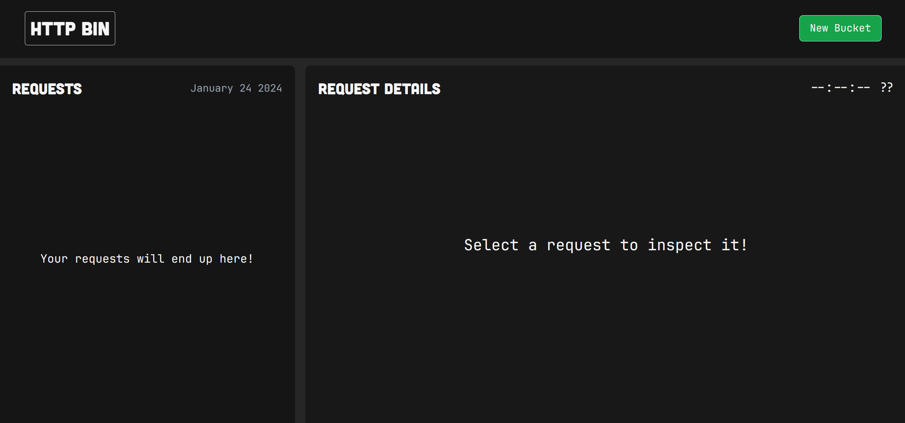
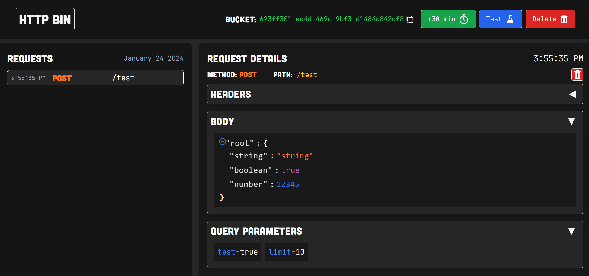

# HTTPBIN 

HttpBin is a simple webhook/request debugger, it creates a "bucket", a unique identifier that maps an endpoint that the user can use to debug requests. Any request sent to that endpoint will be caught and replayed back to the user. Use the bucket identifier with the base URL of the [API](hhttps://github.com/CatalinIuga/HttpBin-API). 

This is a single page application that interacts with this [API](hhttps://github.com/CatalinIuga/HttpBin-API) to create buckets and display the request caught in a more user friendly way.

## Installation

1. Clone the repo
2. Run `npm install`
3. Run `npm run dev` to start the development server, or build and run a production server using `npm run build; npm run preview`;

## Interface

Since it's a SPA, the interface is pretty simple. It has a landing page with a button that creates a bucket, if the user dosent have one already. After that the buttons to extend, test and delete the bucket will appear in the topbar, while the sidebar will display the requests caught by the API. If we select a request, the right side of the screen will display the request headers, body and query parameters in collapsible panels. There is also a button to delete the request from the bucket.

## Technologies

- React
- Tailwind CSS
- Vite
- react-json-view
